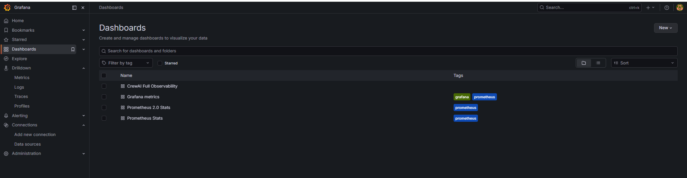
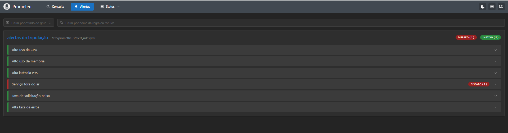
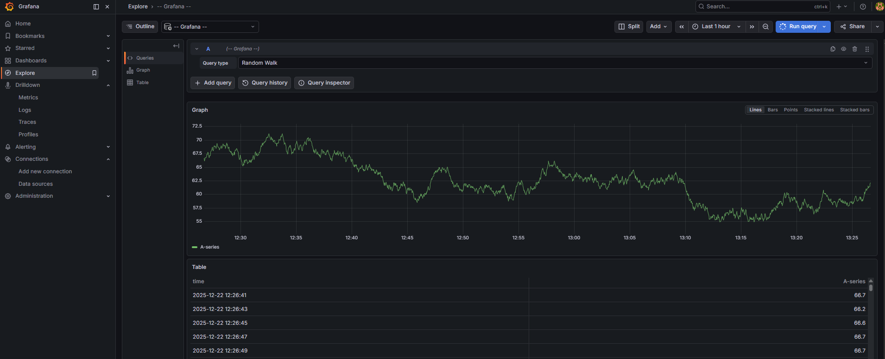

# 🤖 Projeto CrewAI

Este repositório reúne a implementação do **CrewAI**, incluindo configuração de ambiente Python, integração com Google Cloud SDK, Kubernetes, CI/CD automatizado com GitHub Actions e documentação completa para deploy em nuvem.  

<p align="center">
  
</p>

---

## 🏅 Badges

<p align="center">
  
  
  
  
 
  
  
</p>

---

## 📋 Índice / Table of Contents

- [Descrição / Description](#descrição--description)  
- [Status / Status](#status--status)  
- [Funcionalidades / Features](#funcionalidades--features)  
- [Estrutura do Projeto / Project-Structure](#estrutura-do-projeto--project-structure)  
- [Tecnologias / Technologies](#tecnologias--technologies)  
- [Execução / Run](#execução--run)  
- [CI/CD Pipeline](#cicd-pipeline)  
- [Testes de Carga](#testes-de-carga)  
- [📊 Observabilidade](#-observabilidade-com-grafana-e-prometheus)  
- [Resultados e Visualizações / Results--visuals](#resultados-e-visualizações--results--visuals)  
- [Possíveis Melhorias Futuras / Future-Improvements](#possíveis-melhorias-futuras--future-improvements)  
- [Desenvolvedor / Developer](#desenvolvedor--developer)  
- [Licença / License](#licença--license)  
- [Conclusão / Conclusion](#conclusão--conclusion)  

---

## 📖 Descrição / Description

**PT:**  
O projeto **CrewAI** foi desenvolvido para demonstrar práticas modernas de deploy em nuvem, CI/CD e orquestração com Kubernetes. Inclui:  
- Ambiente Python isolado (`crewai-env`).  
- Configuração do Google Cloud SDK (`gcloud`) e `kubectl`.  
- Manifests Kubernetes (`k8s/`) prontos para deploy.  
- Pipeline CI/CD com GitHub Actions (build, testes, Docker, Render e Kubernetes).  
- Testes de carga automatizados (`load-test.yml`).  

**EN:**  
The **CrewAI** project demonstrates modern cloud deployment practices, CI/CD automation, and Kubernetes orchestration. It includes:  
- Isolated Python environment (`crewai-env`).  
- Google Cloud SDK (`gcloud`) and `kubectl` setup.  
- Kubernetes manifests (`k8s/`) ready for deployment.  
- CI/CD pipeline with GitHub Actions (build, tests, Docker, Render, and Kubernetes).  
- Automated load testing (`load-test.yml`).  

---

## 🚧 Status / Status

✅ **Finalizado e pronto para produção** / **Completed and production-ready**  
Deploy real em nuvem é **opcional** e pode ser feito futuramente.

---

## ⚙️ Funcionalidades / Features

| 🧩 Funcionalidade (PT)                  | 💡 Description (EN)                       |
|-----------------------------------------|-------------------------------------------|
| 🐍 Ambiente Python isolado              | 🐍 Isolated Python environment            |
| ☁️ Google Cloud SDK configurado          | ☁️ Google Cloud SDK configured            |
| 📦 Manifests Kubernetes (`k8s/`)        | 📦 Kubernetes manifests ready             |
| 🔄 CI/CD com GitHub Actions             | 🔄 CI/CD pipeline with GitHub Actions      |
| 🐳 Build e push de imagem Docker        | 🐳 Docker image build and push            |
| 🚀 Deploy automático no Render          | 🚀 Automatic deploy to Render             |
| ⚙️ Deploy em Kubernetes (opcional)      | ⚙️ Kubernetes deploy (optional)           |
| 📊 Testes de carga (`load-test.yml`)    | 📊 Load testing automation                |

---

## 📂 Estrutura do Projeto / Project Structure

Este projeto foi desenvolvido com foco em MLOps, orquestração com Kubernetes, deploy em nuvem e automação via CI/CD. Abaixo está a estrutura completa do repositório com comentários sobre cada pasta e arquivo:
```
MEUPROJETOCREWAI/
├── pycache/                  # Cache de compilação Python
├── .github/                     # Workflows do GitHub Actions (CI/CD e testes de carga)
│   ├── ci-cd.yml                 # Pipeline CI/CD completo (testes, build, deploy)
│   └── load-test.yml             # Testes de carga automatizados
├── .pytest_cache/               # Cache de testes Pytest
├── api/                         # Endpoints da API (FastAPI ou Flask)
├── artifacts/                   # Artefatos gerados (modelos, logs, etc.)
├── chromadb/                    # Integração com ChromaDB (vector store)
├── crewai/                      # Núcleo da aplicação CrewAI
├── crewai_agent.egg-info/       # Metadados do pacote Python
├── crewai-env/                  # Ambiente virtual Python
├── crewai-scripts/              # Scripts auxiliares para agentes e tarefas
├── data/                        # Dados brutos ou pré-processados
├── dist/                        # Distribuição do pacote (build local)
├── k8s/                         # Manifests Kubernetes para deploy
│   ├── deployment.yaml
│   ├── service.yaml
│   └── ingress.yaml
├── mlflow/                      # Configuração e tracking com MLflow
├── mlops/                       # Pipelines e automações MLOps
├── mlruns/                      # Experimentos salvos do MLflow
├── observability/               # Logs, métricas e monitoramento
├── scripts/                     # Scripts utilitários e de setup
├── tests/                       # Testes unitários e de integração
├── weaviate/                    # Integração com Weaviate (vector DB)
├── web/                         # Interface web (HTML/Bootstrap ou frontend)
│
├── .dockerignore                # Arquivos ignorados no build Docker
├── .gitignore                   # Arquivos ignorados pelo Git
├── .pypirc                      # Configuração de publicação PyPI
├── docker-compose.yml            # Orquestração local com Docker Compose
├── Dockerfile                   # Build da imagem Docker
├── get-pip.py                    # Script de instalação do pip
├── MANIFEST.in                   # Inclusão de arquivos no pacote Python
│
├── mlflow.db                     # Banco local do MLflow
├── publish-crewai-images.ps1    # Script para publicar imagens Docker
├── pyproject.toml                # Configuração do projeto Python
├── requirements.txt              # Dependências principais
├── requirements-agents.txt       # Dependências específicas dos agentes
├── setup_nltk.py                # Setup de pacotes NLTK
│
├── test_api.py                  # Testes da API
├── test_endpoints.py            # Testes de rotas
├── test_metrics.py              # Testes de métricas
├── test-chromadb.ps1            # Teste de integração com ChromaDB
├── tests.http                    # Testes de endpoints HTTP
│
├── README.md                     # Documentação principal
├── README_deploy-gke.md         # Guia de deploy no GKE
├── README_NUVEM.md              # Guia de deploy em nuvem
├── README_TESTES.md             # Guia de testes
├── README-FINALIZAÇÃO.md        # Encerramento do projeto
```
---


---

## 🧰 Tecnologias / Technologies

- Python 3.11+  
- Docker  
- Kubernetes  
- MLflow  
- GitHub Actions  
- ChromaDB  
- Weaviate  
- FastAPI  
- Prometheus  
- Grafana  
- K6 (testes de carga)  
- Render (deploy automatizado)  
- NLTK  
- Pytest  

<p>
  


  
  
  
  
  
  
  
  
  
  
  
</p>

<br clear="all"/>

---

## ▶️ Execução / Run

### Local
```bash
python src/main.py
```
---

## Kubernetes (opcional)
```
kubectl apply -f k8s/
kubectl get pods
```

---

## 🔄 CI/CD Pipeline
```
O arquivo ci-cd.yml define o pipeline completo:

Testes com Pytest e NLTK.

Build Docker e push para DockerHub.

Deploy automático no Render.

Deploy opcional em Kubernetes via kubectl apply -f k8s/
```

## 📊 Testes de Carga

O arquivo load-test.yml permite rodar testes de carga automatizados para validar desempenho e escalabilidade.
Exemplo de execução:
```
k6 run load-test.yml
```
---

### 📊 Observabilidade com Grafana e Prometheus

O projeto MEUPROJETOCREWAI implementa uma stack completa de observabilidade com Grafana + Prometheus + Alertmanager, permitindo monitoramento em tempo real, alertas inteligentes e visualizações detalhadas.

🔍 Dashboards configurados
```
CrewAI Full Observability — visão geral dos agentes, APIs e métricas principais

Grafana Metrics — métricas internas do Grafana

Prometheus Stats — estatísticas de scraping e targets

Prometheus 2.0 Stats — painel avançado de Prometheus
```
<p align="center">

<br><em>Figura: Lista de dashboards configurados no Grafana</em>
</p>


### 🚨 Alertas implementados

Os alertas são definidos em dois arquivos:
```
alert_rules.yml (alertas gerais)
HighCPUUsage — uso de CPU acima de 80%

HighMemoryUsage — uso de memória acima de 800MB

HighLatencyP95 — latência p95 acima de 5s

ServiceDown — serviço fora do ar

LowRequestRate — taxa de requisições muito baixa

HighErrorRate — taxa de erro acima de 5%

alert_rules_owner.yml (alertas específicos por owner)
HighResponseTimeRogerio — tempo de resposta > 6s para runs do Rogerio

HighRequestVolumeRogerio — mais de 500 requisições em 1h

ServiceDown — indisponibilidade da API

HighCPUUsage / HighMemoryUsage — consumo elevado de recursos

HighAverageResponseTime — tempo médio de resposta > 4s
```
<p align="center">

<br><em>Figura: Alertas da tripulação configurados no Prometheus</em>
</p>


### 📬 Notificações com Alertmanager

Alertas são roteados e enviados via e-mail, Slack e webhook:
```
alertmanager.yml
Roteamento por severity, owner e team

Slack: #incidentes, #monitoramento

E-mail: observability@empresa.com, backend@empresa.com

Inibição de alertas duplicados (warning ignorado se crítico ativo)

alertmanager_owner.yml
Roteamento personalizado para o owner Rogerio

Slack: #alertas-rogerio

E-mail: rogerio@dominio.com

Webhook: http://api:8000/alert-webhook
```


### 📈 Visualizações disponíveis
```
Gráficos de séries temporais (latência, throughput, erros)

Tabelas com métricas por timestamp

Drilldown para logs, traces e perfis

Integração com MLflow para tracking de experimentos
```
<p align="center">

<br><em>Figura: Dashboard de métricas CrewAI no Grafana</em>
</p>


## 🏢 Observabilidade de Nível Enterprise

| Recurso                          | Descrição                                                                 |
|----------------------------------|---------------------------------------------------------------------------|
| 🔍 **Monitoramento profundo**     | Métricas detalhadas de serviços, APIs, containers, bancos, agentes etc.  |
| 🚨 **Alertas inteligentes**       | Regras dinâmicas com thresholds, owners, severidade e contexto técnico   |
| 📬 **Notificações multicanal**    | Slack, e-mail, webhook, SMS, integração com sistemas de resposta          |
| 📊 **Dashboards interativos**     | Visualizações em tempo real com drilldown para logs, traces e métricas   |
| 🧠 **Contexto por owner/equipe**  | Alertas segmentados por responsável, time, serviço e ambiente            |
| 🔁 **Automação de resposta**      | Webhooks que disparam ações automáticas (ex: restart, escalar, logar)    |
| 🔐 **Segurança e auditoria**      | Controle de acesso, rastreabilidade e conformidade com políticas internas|
| 📈 **Escalabilidade horizontal**  | Suporte a múltiplos clusters, serviços e ambientes simultâneos           |


🛠️ Tecnologias utilizadas na observabilidade
<p>


</p>

<br clear="all"/>

---

## 📈 Resultados e Visualizações / Results & Visuals

✔️ Testes unitários executados com sucesso.
✔️ Build Docker publicado no DockerHub.
✔️ Deploy automático no Render concluído.
✔️ Manifests Kubernetes aplicados (opcional).
✔️ Testes de carga validados.

---

## 🔮 Possíveis Melhorias Futuras / Future Improvements

Integração com monitoramento Prometheus/Grafana.
Autoscaling configurado no cluster Kubernetes.
Segurança avançada com RBAC e secrets.
Pipeline CI/CD expandido para múltiplos ambientes.

---

## 👨‍💻 Pessoa Desenvolvedor do Projeto / Project Developer

- [Rogerio](https://github.com/Rogerio5)
- [Ronaldo](https://github.com/Ronaldo94-GITHUB)

---

## 📜 Licença / License
Este projeto está sob licença MIT. Para mais detalhes, veja o arquivo LICENSE.

This project is under the MIT license. For more details, see the LICENSE file

---

## 🏁 Conclusão / Conclusion

O projeto CrewAI demonstra práticas modernas de desenvolvimento e deploy em nuvem, CI/CD automatizado e orquestração com Kubernetes.
Está finalizado e pronto para produção, com documentação clara e pipelines configurados.
O deploy real em nuvem é opcional e pode ser realizado futuramente conforme necessidade
